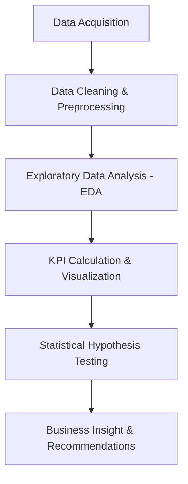

# 📊 A/B Testing Analysis: Marketing Campaign Comparison

## 📝 Executive Summary
This project presents a rigorous statistical analysis of an A/B test conducted on two distinct marketing campaigns: **Control** and **Test**. The primary objective was to determine which campaign strategy yields a significantly higher conversion rate. Through hypothesis testing and deep-dive metric exploration, we evaluated performance across multiple KPIs including reach, engagement, and conversion.

**Key Result:** The Control Campaign outperformed the Test Campaign with a statistically significant higher conversion rate of **9.83%** vs **8.64%** ($p = 0.026$).

---

## 🚀 Project Workflow

---

## 📖 Data Dictionary
The dataset contains daily performance metrics for both campaign groups.

| Feature | Description |
| :--- | :--- |
| **Campaign Name** | Identifier for the group (Control vs. Test) |
| **Date** | Date of the recorded metrics |
| **Spend [USD]** | Total amount spent on the campaign in USD |
| **Impressions** | Number of times the ad was shown |
| **Reach** | Number of unique users who saw the ad |
| **Clicks** | Number of clicks on the ad |
| **Searches** | Number of searches performed on the website/app |
| **Content Views** | Number of times users viewed product content |
| **Add to Carts** | Number of items added to the shopping cart |
| **Purchases** | Number of completed transactions |

---

## 🔬 Statistical Methodology

### Hypothesis Formulation
To evaluate the effectiveness of the campaigns, we conducted a **One-Tailed Z-Test for Proportions**.

- **Null Hypothesis ($H_0$):** $p_{control} \leq p_{test}$ (The Control Campaign conversion rate is less than or equal to the Test Campaign).
- **Alternative Hypothesis ($H_1$):** $p_{control} > p_{test}$ (The Control Campaign conversion rate is significantly higher than the Test Campaign).

### Statistical Parameters
- **Significance Level ($\alpha$):** 0.05
- **Test Statistic:** Z-score for proportions
- **Primary Metric:** Conversion Rate (Purchases / Number of Impressions or Content Views)

---

## 📈 Key Findings

- **Higher Conversion:** The Control Campaign achieved a conversion rate of **9.83%**, while the Test Campaign achieved **8.64%**.
- **Statistical Significance:** With a p-value of **0.026**, we reject the null hypothesis at the 95% confidence level.
- **Metric Highlights:**
    - The Control Campaign showed higher stability in daily purchases.
    - Test Campaign had higher reach but lower engagement-to-purchase efficiency.

---

## 💡 Business Recommendations

1. **Scale the Control Strategy:** Given its statistically superior conversion rate, the Control Campaign strategy should be prioritized for future budget allocation.
2. **Optimize Test Campaign Engagement:** Analyze why the Test Campaign (despite high reach) failed to convert at the same rate. Investigating the "Add to Cart" to "Purchase" drop-off may reveal friction points in the new strategy.
3. **Refine Targeting:** Focus on the audience segments that showed the highest conversion in the Control group to further boost ROI.

---

## 🛠️ Technologies Used
- **Language:** Python 3.x
- **Libraries:**
    - `pandas`: Data manipulation and cleaning
    - `numpy`: Numerical computations
    - `statsmodels`: Statistical modeling and hypothesis testing
    - `matplotlib`/`seaborn`: Data visualization

---

## 📬 Contact & Portfolio
*Created by Jules - Data Science Specialist*
[GitHub Portfolio](https://github.com/) | [LinkedIn](https://linkedin.com/)
